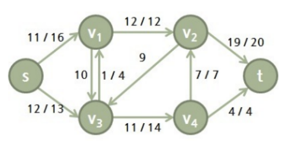

### Maximumflow

#### 개요
Network flow란 각각의 간선에 정해진 용량보다 작은 유량이 주어진 방향그래프를 말하며,
Maximum flow란 위 수원지(S)에서 수요지(T)까지 공급할 수 있는 최대 유량을 말한다.
#### 예시문제
V (2<= V <=10)개의 정점과 E (2<= E <=20)개의 간선이 용량을 갖는 그래프에서 두 정점 사이에 얼마나 많은 유량을 보낼 수 있는지를 계산하여 출력하시오, 각 간선의 유량은 해당 간선의 용량을 초과할 수 없다.
첫 라인은 테스트 케이스 수, 두번째 라인은 수원지, 수요지를 포함한 정점의 수와 그를 연결하는 방향성을 띈 간선의 수가 입력되며, 다음 라인 부터는 간선의 정보가 입력된다.
간선의 정보는 출발지, 도착지, 용량 순이다.


```
입력
2 // 테스트 케이스 수
6 10 // 정점, 간선의 수
0 1 16
0 2 13
1 2 10
1 3 12
2 1 4
2 4 14
3 2 9
3 5 20
4 3 7
4 5 4
6 7
0 1 10
0 3 8
1 2 10
1 4 6
2 5 10
3 2 8
4 5 6
```
```
출력
#1 23
#2 16
```