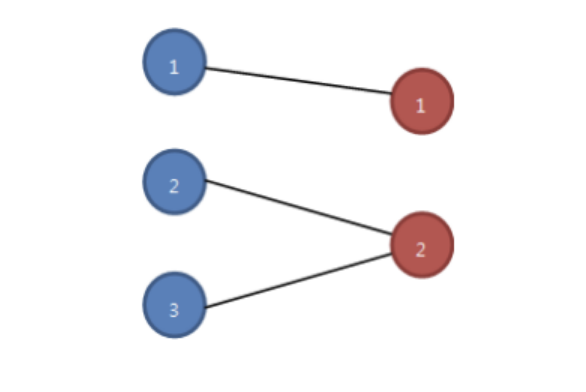

### BipartiteMatch

#### 개요
그래프의 최대 이분 매칭은 두 간선이 같은 정점을 공유하지 않는 간선의 최대 집합을 말한다.
#### 예시문제
A그룹과 B그룹이 있다. 각각의 그룹에는 1부터 시작하는 n명의 멤버들이 있으며, 서로 다른 그룹의 멤버들을 연결하는 선이 존재한다. 이 때, 서로 다른 그룹의 멤버끼리 2명씩 짝을 지을 때, 가능한 최대 짝의 수를 출력하시오.
 

```
입력
2 // test case 수
3 // A그룹 멤버 수
2 // B그룹 멤버 수
3 // 연결 선의 수
1 1 // A그룹1과 B그룹1 연결
2 2 // A그룹2와 B그룹2 연결
3 2 // A그룹3과 B그룹2 연결
4
5
8
1 1
1 2
1 3
2 2
2 3
2 4
3 3
4 5
```
```
출력
#1 2 // 가능한 최대 짝의 수
#2 4
```