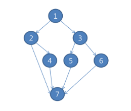

### DFS Searching

#### 개요
깊이 우선 탐색은 맹목적 탐색방법의 하나로 한 노드를 시작으로 인접한 다른 노드를 재귀적으로 탐색해가고 끝까지 탐색하면 다시 위로 와서 다음을 탐색하여 검색한다.

#### 예시문제


위와 같은 그래프에서 숫자가 있는 원은 정점(Vertex)라고 하고, 정점과 정점을 잇는 연결선을 간선(Edge)이라고 한다. 정점의 최대 개수는 30개이다. 간선의 길이를 1이라고 하고, N개의 정점과 M개의 간선이 주어졌을 때, DFS를 이용하여 시작점으로부터 도착점까지의 최단 경로를 찾아 거리를 출력하시오. 시작점에서 도착점으로 갈 수 있는 방법이 없는 경우 -1을 출력하시오.

```
입력
2 // test case 개수
8 10 1 8// 정점의 수, 간선의 수, 시작점, 도착점
1 2 // 정점 간 연결 관계. 1에서 2로 이동 가능
1 3
2 7
2 4
3 5
3 6
4 7
5 7
6 7
6 8
8 10 2 8
1 2
1 3
2 7
2 4
3 5
3 6
4 7
5 7
6 7
6 8
```
```
출력
#1 3 // 최단경로의 길이
#2 -1
```