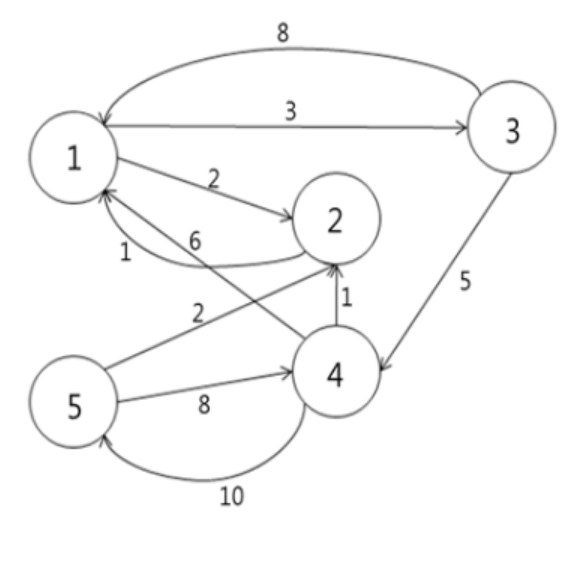

### FloydWarshall

#### 개요
플로이드-워셜 알고리즘(Floyd-Warshall Algorithm)은 그래프에서 모든 꼭짓점 사이의 최단 경로의 거리를 구하는 알고리즘이다. 제일 바깥쪽 반복문은 거쳐가는 꼭짓점이고, 두 번째 반복문은 출발하는 꼭짓점, 세 번째 반복문은 도착하는 꼭짓점이다.
#### 예시문제
N 개의 정점(Vertex)과 방향과 가중치 w를 가진 M개의 간선(edge)으로 이루어진 방향 그래프(Directed Graph)가 주어진다. 예를 들어 Figure 1의 경우 N이 5, M이 10인 방향 그래프이다. 이때 모든 정점들의 쌍(A, B)에 대해 A에서 시작하여 B로 도착하는 최단 거리를 구하시오.


```
입력
1 // # of test case
5 // 정점 개수 N (1 <= N <= 100)
10 // 간선 개수 M (1 <= M <= 10,000)
1 2 2 // 1번 정점-> 2번 정점 중 가중치 2의 간선
// (1 <= w <= 100)
1 3 3
2 1 1
3 1 8
3 4 5
4 1 6
4 2 1
4 5 10
5 2 2
5 4 8
```
```
출력
#1
// N * N 최단 거리 맵 출력
0 2 3 8 18
1 0 4 9 19
7 6 0 5 15
2 1 5 0 10
3 2 6 8 0
```