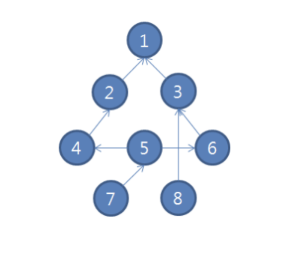

### topologicalsorting

#### 개요
위상 정렬(topological sorting)은 유향 그래프의 정점(vertex)을 간선의 방향을 거스르지 않도록 나열하는 것을 의미한다.
#### 예시문제


위와 같은 그래프에서 숫자가 있는 원은 정점(Vertex)라고 하고, 정점과 정점을 잇는 연결선을 간선(Edge)이라고 한다. N(<=25)개의 정점과 M(<=25)개의 간선이 주어졌을 때, 도착점 D 까지의 위상정렬을 구하시오.
```
입력
3 // 테스트 개수
8 7 // 정점의 수, 간선의 수
1 // 목적지
2 1 // 2번 정점에서 1번 정점으로의 간선
3 1
4 2
6 3
8 3
5 4
7 5
5 6
1
3 1
2 1
3 2
4 2
4 3
5 4
7 7
1
2 1
4 1
6 2
3 2
2 4
5 4
7 5
```
```
출력
#1 7 5 4 2 8 6 3 1
#2 5 4 3 2 1
#3 7 5 6 3 2 4 1
```